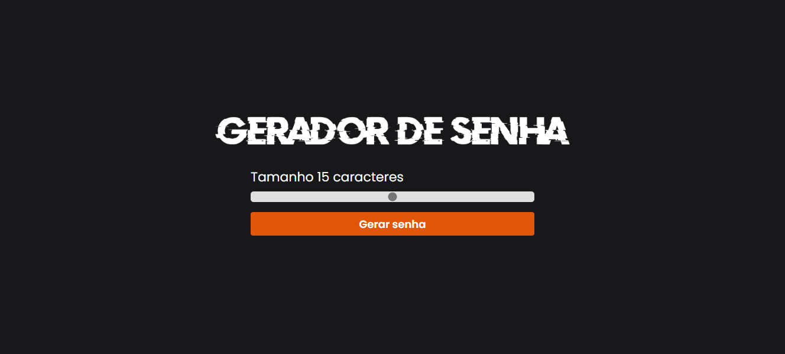

# 🔐 Gerador de Senhas

Este projeto é um **Gerador de Senhas** desenvolvido utilizando HTML, CSS e JavaScript. Seu objetivo é fornecer uma maneira simples e rápida de gerar senhas aleatórias com base no tamanho escolhido pelo usuário, permitindo a cópia da senha gerada diretamente para a área de transferência.

## 🛠 Como Funciona

O gerador permite ao usuário ajustar o tamanho da senha por meio de um **controle deslizante (range)**, que varia entre 5 e 25 caracteres. Após definir o tamanho desejado, o usuário pode clicar no botão "Gerar senha" para que crie uma senha aleatória composta por letras maiúsculas, minúsculas, números e caracteres especiais. A senha gerada é exibida, e o usuário pode copiá-la para a área de transferência com um único clique.

## ⚙️ Funcionalidades

- **`🕹` Controle deslizante (range)**: Permite que o usuário defina o tamanho da senha (variando de 5 a 25 caracteres).
- **`🔑` Geração de senhas aleatórias**: A senha é formada por uma combinação de letras (maiúsculas e minúsculas), números e símbolos.
- **`📋` Cópia da senha**: A senha gerada pode ser copiada para a área de transferência com um clique simples, facilitando o uso imediato.

## 👩🏽‍💻 Tecnologias Usadas

- **`HTML`**: Utilizado para estruturar o conteúdo da página, definindo a disposição dos elementos.
- **`CSS`**: Responsável pela estilização da interface, proporcionando um design moderno e responsivo.
- **`JavaScript`**: Implementa a lógica de geração das senhas aleatórias, controle interativo e cópia para a área de transferência.

## 📂 Estrutura do Projeto

O projeto está organizado nos seguintes arquivos e pastas:

- **`index.html`**: Arquivo principal que contém a estrutura e marcação.
- **`style.css`**: Arquivo de estilo que define o layout e design visual da página.
- **`script.js`**: Arquivo JavaScript que implementa a lógica de geração das senhas e interações com o usuário.
- **`assets/`**: Pasta que contém imagens, como o logo e o ícone do site.

Você pode acessar o Gerador de Senhas através do seguinte link:

<a href="https://gerador-de-senha-plum.vercel.app/" target="_blank">**Acesse o Gerador de Senhas**</a>
